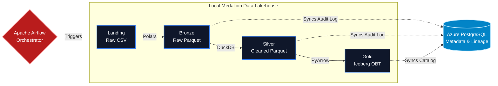

# 🏡 PropIntel | Real Estate Data Lakehouse

> A highly optimized, modern Medallion Architecture (Landing → Bronze → Silver → Gold) built to process large-scale Pakistani real estate market data. 

## 🌟 Project Overview

PropIntel is a production-grade data engineering pipeline designed to handle terabyte-scale data transformation without relying on heavy distributed systems like Spark. 

By combining **DuckDB's** vectorized in-memory processing, **Polars** for high-speed streaming, and **Apache Iceberg** for ACID transactions, this pipeline processes complex Slowly Changing Dimensions (SCD Type 2) locally at lightning speed, while safely syncing mission-critical metadata to an **Azure PostgreSQL** cloud database.

---

## 🏗️ Architecture Design

The architecture physically decouples **Storage/Compute** (which run locally for maximum I/O speed) from **Metadata/Lineage** (which syncs to the cloud for persistence).



---

## 🚀 Key Engineering Achievements

1. **N+1 Database Latency Eliminated**: The custom `LineageTracker` uses RAM-buffered bulk-flushing. Instead of sending an `INSERT` request for every file, it aggregates results and fires a single `executemany` statement per batch, reducing Azure PostgreSQL network latency by 99.9%.
2. **True SCD Type 2 Without Spark**: Eliminated the need for a rigid Star Schema. The Gold layer implements a One Big Table (OBT) architecture with native time-travel (`valid_from`, `valid_to`, `is_current`) powered entirely by DuckDB sequential merging and PyIceberg.
3. **Decoupled Compute & Metadata**: Massive Parquet files remain on local high-speed SSDs for fast processing, while the Iceberg JDBC Catalog and pipeline lineage are strictly managed in the cloud.
4. **Interactive Target Rollbacks**: A custom CLI (`dev_hard_reset.py`) allows surgical rollbacks of specific Medallion layers (e.g., wiping `silver` while preserving `bronze`) without having to write manual SQL drop statements.

---

## 📊 The Medallion Pipeline

| Layer | Engine | Format | Engineering Purpose |
|-------|--------|--------|---------|
| **Landing** | — | `CSV` | Raw incoming data drop zone (`data/landing_zone/`). |
| **Bronze** | **Polars** | `Parquet` | Streaming `sink_parquet` for ultra-fast 1-to-1 format conversion and schema preservation. |
| **Silver** | **DuckDB** | `Parquet` | Heavy data cleansing: `try_strptime` multi-format date parsing, geo-fencing, unit normalization (Marla), and price anomaly flagging. |
| **Gold** | **Iceberg** | `Iceberg` | Advanced temporal tracking. Implements SCD Type 2 logic to track historical price fluctuations across properties over time. |

---

## 🛠️ Technology Stack

- **Orchestration**: Apache Airflow (Dockerized)
- **Compute Engines**: DuckDB & Polars
- **Storage Formats**: Apache Parquet & Apache Iceberg
- **Metadata Store**: Azure PostgreSQL (JDBC Catalog)
- **Language**: Python 3.11

---

## ⚡ Getting Started

### 1. Environment Configuration
Create a `.env` file from the template and provide your **Azure PostgreSQL** credentials:
```bash
cp .env.example .env
# Open .env and add your Azure Host, DB Name, User, and Password
```

### 2. Install Local Dependencies
If you plan to run the Python scripts manually for debugging, install the required libraries:
```bash
python -m pip install -r requirements.txt
```

### 3. Spin Up Airflow (Docker)
To start the orchestration layer, use the custom `Dockerfile` which automatically bakes in the PyIceberg and SQLAlchemy dependencies:
```bash
docker-compose up --build -d
```
Access the Airflow UI at `http://localhost:8080`.

### 4. Running the Pipeline Manually
You can execute the pipeline layers directly from your IDE in chronological order:
1. `python src/ingestion/bronze_ingest.py`
2. `python src/transformation/silver_transform.py`
3. `python src/loading/gold_publish.py`
4. `python src/utils/testing_gold_iceberg.py` (To verify Gold Layer integrity)

### 5. Developer Tools
If you make a mistake and need to wipe a layer to try again:
```bash
python src/utils/dev_hard_reset.py
```
*Select your target layer (e.g., `silver`) to instantly wipe the local files and clear the Azure metadata!*
