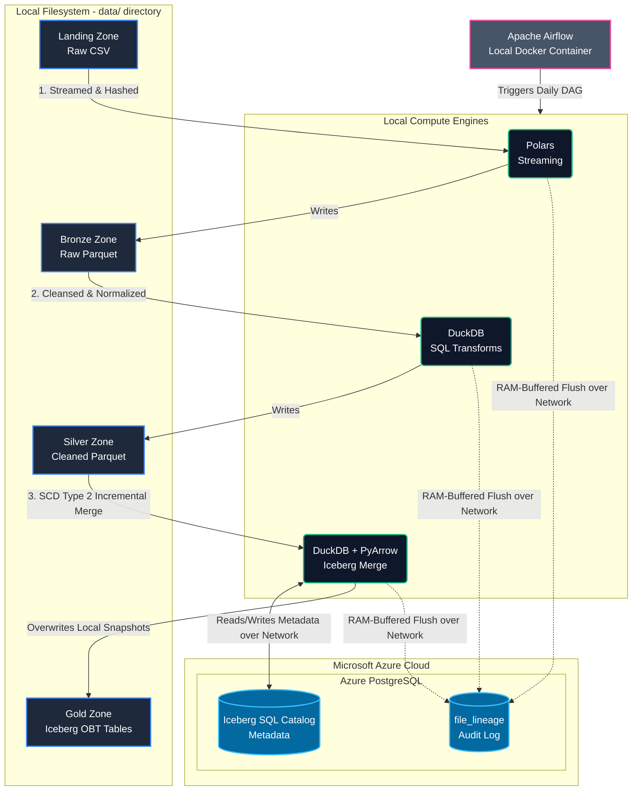

# PropIntel — Property Intelligence ETL Platform

A data engineering project that builds a complete **Medallion Architecture** (Landing → Bronze → Silver → Gold) for processing Pakistani real estate market data at scale. The pipeline is orchestrated by **Apache Airflow**, transforms data through progressively cleaner layers using **Polars** and **DuckDB**, and outputs analytical datasets as **Apache Iceberg** tables.

> **📍 Current Architecture State**: This repository represents the highly optimized **Local Environment** version. All compute (Airflow, DuckDB, Polars) and data storage (Parquet, Iceberg files) run purely on the local machine/Docker. The *only* cloud-hosted component is the **Azure PostgreSQL Database**, which manages the file lineage audit logs and PyIceberg Catalog metadata.

---

## Architecture Diagram



---

## Engineering Highlights

### 1. Hybrid Storage Model (Local Data, Cloud Metadata)
By splitting the data and metadata, we achieve lightning-fast local read/write speeds for our massive Parquet files using DuckDB, while securely persisting our mission-critical `file_lineage` audit trails and Iceberg schema metadata in an enterprise-grade **Azure PostgreSQL** instance.

### 2. Deep Iceberg SCD Type 2 Integration (Gold Layer)
Instead of a rigid Star Schema, the Gold layer implements an ultra-fast **One Big Table (OBT)** architecture with native Slowly Changing Dimensions (SCD) Type 2 tracking (`is_current`, `valid_from`, `valid_to`). DuckDB evaluates complex incremental state changes against historical snapshots in RAM, and PyArrow physically commits the ACID overwrites to the local Iceberg warehouse. 

### 3. RAM-Buffered Bulk-Flush Lineage (Solving N+1 Latency)
The pipeline avoids network throttling to Azure Postgres by using in-memory Python sets and buffers. Instead of sending an `INSERT` request for every single file processed, the `LineageTracker` aggregates results and fires a single `executemany` statement per batch, reducing network latency by 99.9%.

### 4. Interactive Target Rollbacks (`dev_hard_reset.py`)
Development and debugging are protected by an interactive CLI utility. Instead of manually deleting files and running raw SQL drops, you can instantly rollback targeted layers (`gold`, `silver`, `bronze`) which safely un-does the Iceberg metadata commits and deletes the specific parquet files without damaging the raw data.

---

## Data Flow

| Layer | Format | Engine | Purpose |
|-------|--------|--------|---------|
| **Landing** | Raw CSV (~50 MB each) | — | Incoming data drop zone (`data/landing_zone/`) |
| **Bronze** | Parquet | Polars (streaming `sink_parquet`) | 1-to-1 format conversion, schema preservation |
| **Silver** | Parquet | DuckDB | Type casting, safe date parsing (`try_strptime`), geo-fencing, unit normalization (Marla), price capping, SCD2 prep |
| **Gold** | Apache Iceberg | DuckDB + Iceberg | SCD Type 2 tracking, Anomaly flagging, Property classification (`propintel.gold_sales` / `rentals`) |

---

## Project Structure

```
PropI/
├── dags/                               # Airflow DAG definitions
│   └── propintel_daily_etl.py          # Main orchestration DAG (@daily)
│
├── src/                                # Core pipeline code
│   ├── ingestion/
│   │   └── bronze_ingest.py            # Landing → Bronze (Polars)
│   ├── transformation/
│   │   └── silver_transform.py         # Bronze → Silver (DuckDB)
│   ├── loading/
│   │   └── gold_publish.py             # Silver → Gold (Iceberg SCD2 Merge)
│   ├── helper_files/
│   │   ├── database.py                 # Azure PostgreSQL connection pool
│   │   ├── lineage.py                  # RAM-buffered bulk-flush tracker
│   │   └── iceberg_catalog.py          # PyIceberg SQL Catalog definitions
│   └── utils/
│       ├── dev_hard_reset.py           # Interactive environment rollback CLI
│       └── testing_gold_iceberg.py     # Gold layer validation script
│
├── data/                               # Local Data Lake (gitignored)
│   ├── landing_zone/                   # Raw CSVs
│   ├── bronze/                         # Raw Parquet files
│   ├── silver/                         # Cleaned Parquet files
│   └── gold/warehouse/                 # Physical Iceberg data files
│
├── docker-compose.yml                  # Airflow infrastructure setup
├── Dockerfile                          # Custom Airflow image with Iceberg/Postgres deps
├── requirements.txt                    # Python dependencies
├── .env.example                        # Environment variables template
├── cloud_deployment.md                 # Migration architecture plan for 100% Azure
└── README.md                           # You are here
```

---

## Setup & Execution

### 1. Environment Configuration
Create a `.env` file from the example and provide your **Azure PostgreSQL** credentials:
```bash
cp .env.example .env
# Edit .env with your Azure Host, DB Name, User, and Password
```

### 2. Install Local Dependencies
If you are running the Python scripts locally (outside of Airflow), install the required libraries:
```bash
python -m pip install -r requirements.txt
```

### 3. Running Airflow via Docker
To spin up the orchestration layer, use the custom `Dockerfile` which automatically bakes in the PyIceberg and SQLAlchemy dependencies:
```bash
docker-compose up --build -d
```
Access the Airflow UI at `http://localhost:8080`.

### 4. Running the Pipeline Manually
You can execute the pipeline layers directly from your IDE in chronological order:
1. `python src/ingestion/bronze_ingest.py`
2. `python src/transformation/silver_transform.py`
3. `python src/loading/gold_publish.py`
4. `python src/utils/testing_gold_iceberg.py` (To verify Gold Layer integrity)

### 5. Need to Undo?
If you make a mistake and need to wipe a layer to try again:
```bash
python src/utils/dev_hard_reset.py
```
*Select your target layer (e.g., `silver`) to instantly wipe the local files and clear the Azure metadata!*
