# PropIntel — Cloud-Native Data Lakehouse

A production-grade, fully cloud-native data engineering pipeline that processes real estate market data through a complete **Medallion Architecture** (Landing → Bronze → Silver → Gold) on **Azure Data Lake Storage Gen2**. 

The pipeline begins with a multi-threaded **Google Colab** script that pulls existing CSV files from a connected Google Drive folder and uploads them in parallel to the Azure Blob landing zone, simulating a streaming ingestion source without paid API access. An **Apache Airflow** DAG then orchestrates the data through Polars (Bronze) and DuckDB (Silver/Gold), ultimately loading it into an **Apache Iceberg** lakehouse with **SCD Type 2** historical tracking. All metadata and file lineage are centrally audited in **Azure PostgreSQL**.

| | |
|---|---|
| **Data Source** | Multi-threaded Google Colab script pulling CSVs from Google Drive to Azure Blob |
| **Scale** | Fully cloud-native. Designed for TB scale processing via DuckDB + Iceberg. |
| **Orchestration** | Apache Airflow (Dockerized, `@daily` schedule) |
| **Compute Environment** | Azure Virtual Machine (Ubuntu) hosting Airflow and processing scripts |
| **Compute Engines** | Polars (Bronze streaming), DuckDB (Silver SQL transforms + Gold SCD2 merge) |
| **Storage** | Azure Data Lake Storage Gen2 (ADLS) — Apache Parquet / Apache Iceberg |
| **State Management** | Azure PostgreSQL Flexible Server — file lineage audit log + Iceberg SQL Catalog |

---

## 🏗️ Architecture Flow

> The diagram below is written in [Mermaid.js](https://mermaid.js.org/). GitHub renders it automatically as a visual flowchart.

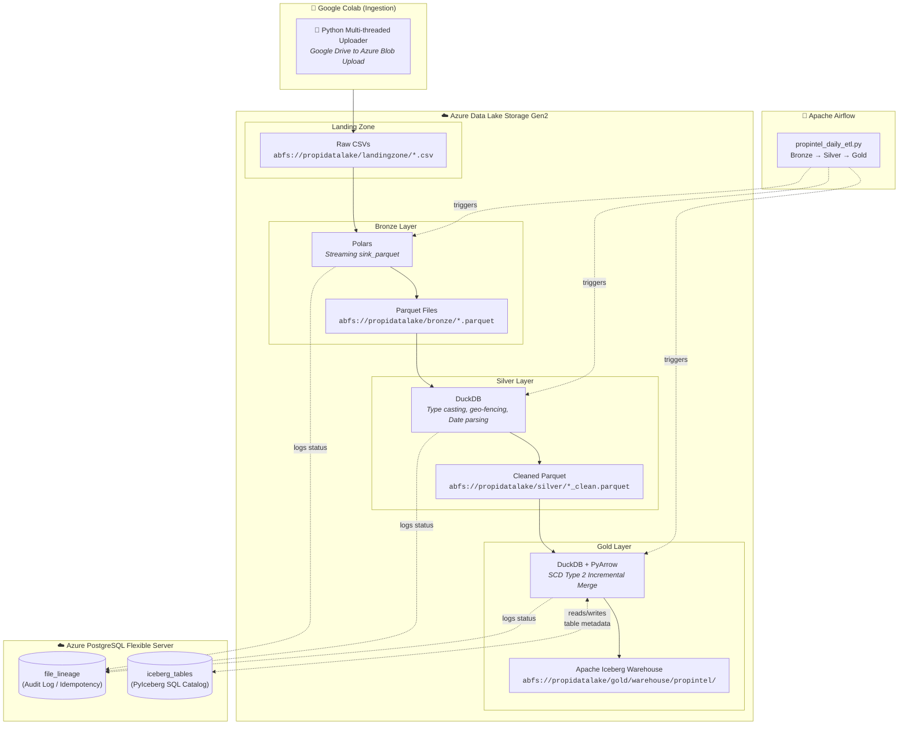

---

## ⚙️ What Happens at Each Layer

### 1. Ingestion — Google Colab Streaming Simulator
A multi-threaded Python script running in Google Colab that pulls existing CSV files from a connected Google Drive folder and uploads them in parallel to the **Azure Data Lake Landing Zone**, simulating a streaming ingestion source without paid API access.

### 2. Bronze — Raw Ingestion to Parquet
**Engine:** Polars
- Airflow triggers the ingestion script, which then scans the Azure landing zone for new CSV files.
- Computes a SHA-256 hash of each file (this hash becomes the **lineage key** that tracks the file across every layer).
- Streams the CSV into a compressed Parquet file directly in Azure using Polars' `sink_parquet` (avoiding memory bottlenecks).
- Logs the result to the Azure PostgreSQL `LineageTracker`.

### 3. Silver — Cleansing & Standardization
**Engine:** DuckDB
- Queries Azure Postgres to find which Bronze files have been processed but not yet cleaned.
- DuckDB connects directly to Azure Blob (`abfs://`) and runs a highly optimized `COPY` statement to apply transformations:
  - **Type casting** (safely converting strings to integers/doubles/dates).
  - **Geo-fencing** (validating latitude/longitude bounds).
  - **Price capping** and **Unit normalization**.
- Writes the cleaned output to the Silver container in Azure as a new Parquet file.

### 4. Gold — Historical Tracking (SCD Type 2 Lakehouse)
**Engine:** DuckDB + PyIceberg
- Airflow triggers the Gold layer to process Silver files sequentially.
- Separates data into **Sales** (`propintel.gold_sales`) and **Rentals** (`propintel.gold_rentals`).
- Loads the existing Iceberg table metadata from Azure Postgres.
- DuckDB pulls the incoming data and the existing Iceberg data into memory and executes a highly optimized SQL **Window Function** to calculate the entire **SCD Type 2 Timeline** (tracking exact price changes across time with `is_current`, `valid_from`, and `valid_to` flags).
- Overwrites the PyIceberg table atomically, creating a new time-travel snapshot.

**Limitations & Trade-offs:**
- **Late Data Arrival:** The current SCD2 window logic assumes data is ingested in chronological order. Late-arriving historical records can cause timeline shifting requiring a full rebuild of the history for that specific property ID.
- **Merge Into Limitation:** Because DuckDB combined with PyArrow/PyIceberg currently lacks a native `MERGE INTO` SQL capability for Iceberg tables, a bulk overwrite of the partition/table was required. We successfully maintained the complex SCD2 logic entirely in memory before executing the bulk overwrite to Iceberg.

---

## 🔒 Idempotency & State Management

All pipeline state lives in a single **Azure PostgreSQL** instance, which serves two distinct purposes:

| Table | Managed By | Purpose |
|-------|-----------|---------|
| `file_lineage` | Our Python code (`LineageTracker`) | Tracks every file across every layer — hash, status, row count, error messages, retry count, Airflow run ID |
| `iceberg_tables` | PyIceberg (automatic) | Stores Iceberg table metadata — schema definitions, partition specs, pointers to physical data files |

The `LineageTracker` uses a **RAM-buffered bulk-flush** pattern: it pre-loads all known hashes into a Python `set()` at startup, processes files, and writes results to the database in a single `executemany` batch at the end — reducing network round-trips to Azure by orders of magnitude. This makes the pipeline **perfectly idempotent**; if Airflow fails halfway, it automatically resumes exactly where it left off without duplicating data.

---

## 📸 System Operations Showcase

### 1. Google Colab Multi-threaded Ingestion
Uploading existing CSV files from Google Drive directly to Azure Storage Gen2 in parallel, simulating a streaming data source.
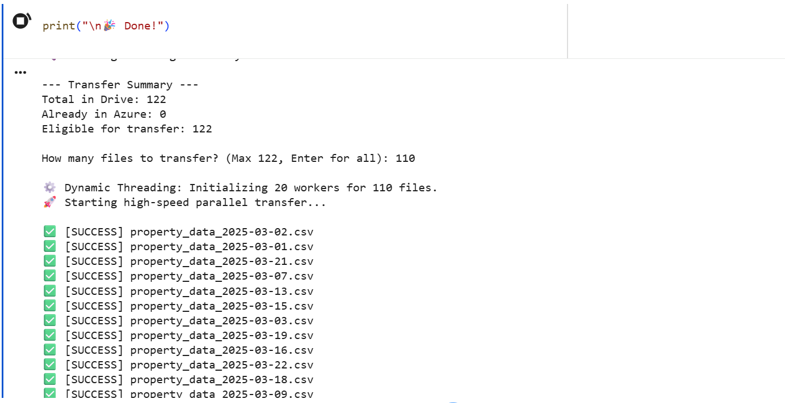
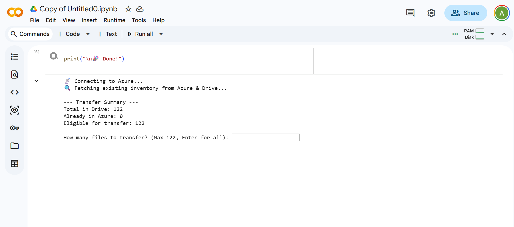

### 2. Azure Data Lake Architecture Tree
The Medallion architecture successfully populated across Azure Storage containers.
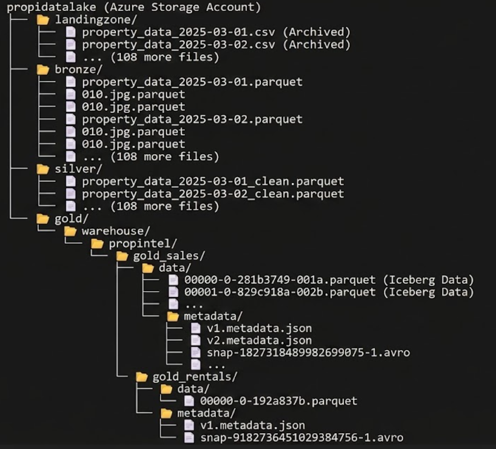

### 3. Postgres Lineage Tracker (Idempotency)
The central audit log in Azure PostgreSQL. By securely hashing every file on arrival, the pipeline guarantees exactly-once processing (idempotency). If a file crashes midway, the tracker ensures we safely resume without duplicating rows.
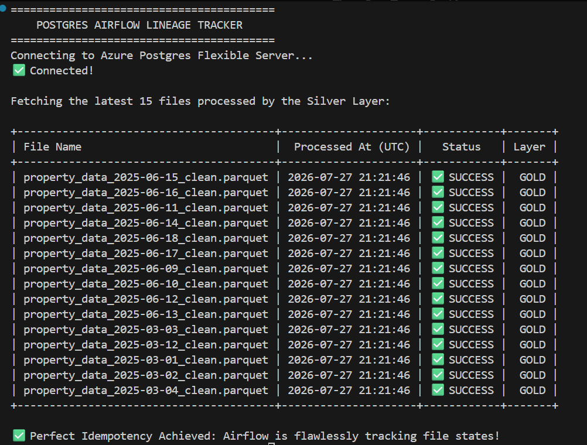

### 4. Airflow Orchestration (DAG & Gantt)
Seamless scheduling and parallel execution across 122 files. 
*Note: In the Gantt chart below, the long red blocks honestly reflect that the Gold Layer failed 8 times during active development before it was successfully debugged and stabilized.*
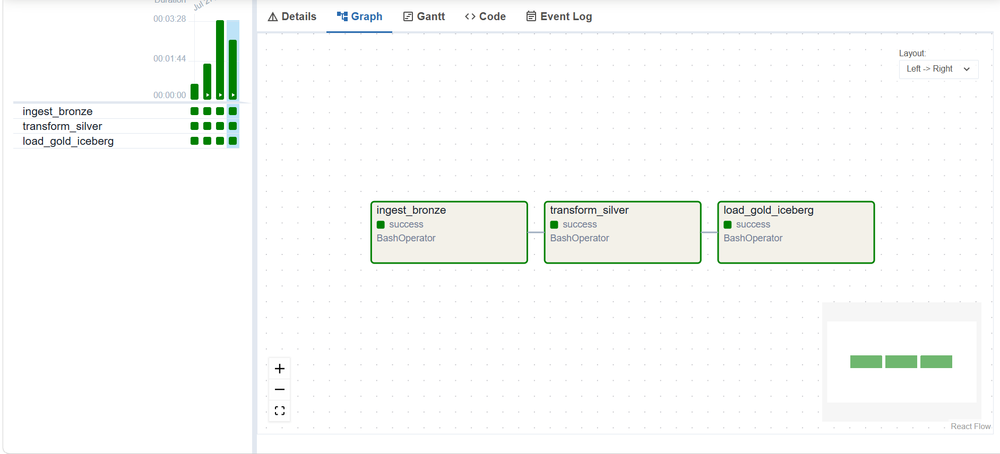
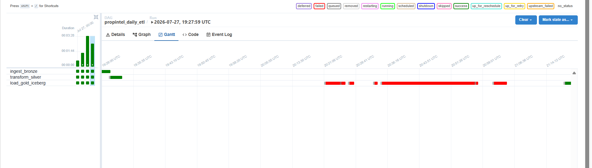

### 5. Interactive Rollback System
Custom CLI tool for nuclear resets and data rollback. During development, three extra teardown DAGs were created specifically for targeted testing. These DAGs guaranteed the pipeline worked smoothly by allowing developers to instantly wipe a specific layer and trigger a clean rebuild.
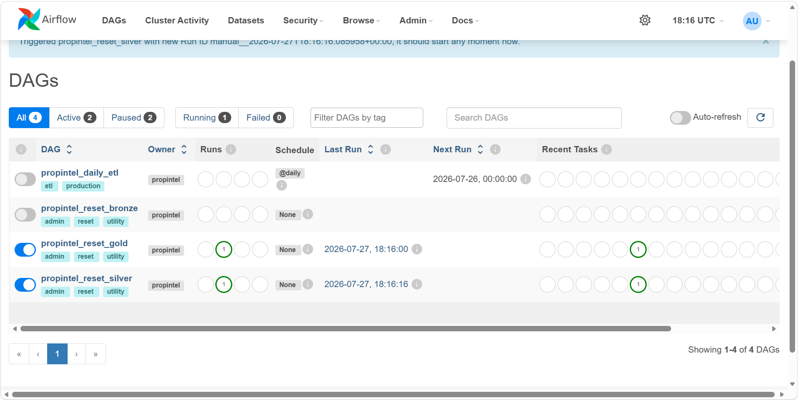

### 6. Bronze Reset DAG (Safe Teardown)
Airflow DAG for safely tearing down and rebuilding the Bronze layer without affecting Silver or Gold.
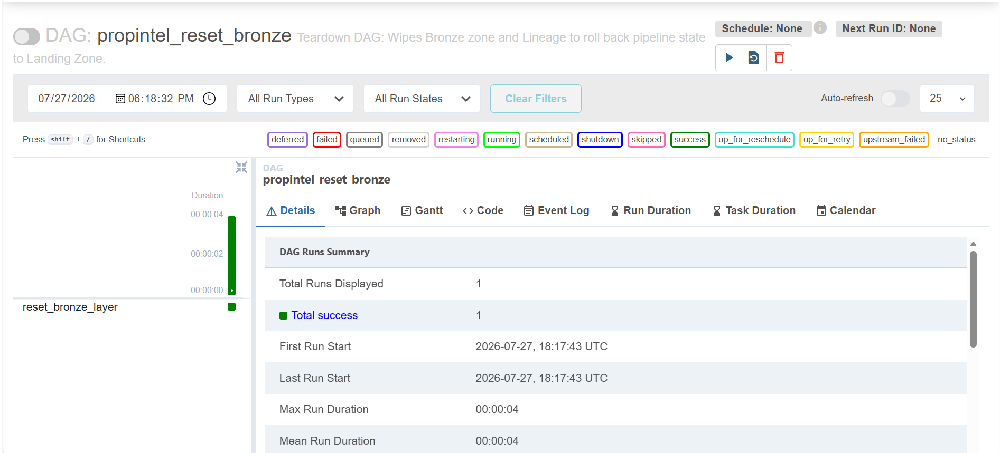

### 7. Azure Portal — Provisioned Cloud Resources
The actual Azure resource group showing the provisioned VM, Storage Account, PostgreSQL server, and networking.
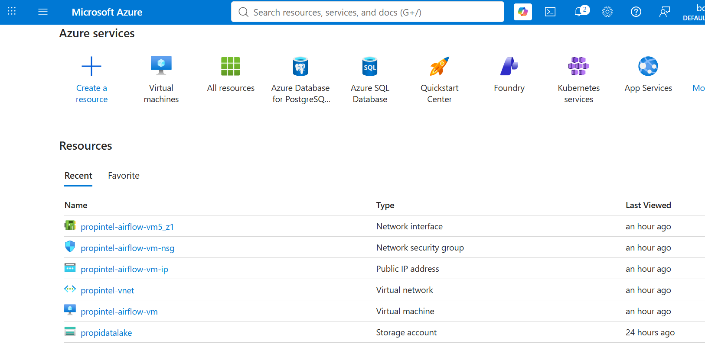

### 8. Gold Layer: Apache Iceberg & SCD Type 2
Showcasing DuckDB perfectly tracking historical price changes over time in the Gold Iceberg tables.
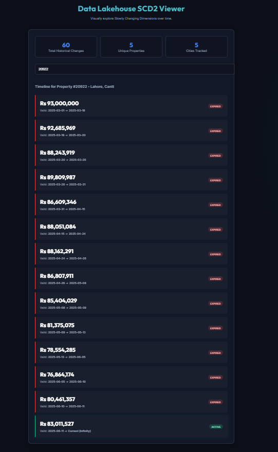

---

## 📁 Project Structure

```
PropI/
├── dags/
│   ├── propintel_daily_etl.py              # Airflow DAG — orchestrates Bronze → Silver → Gold
│   ├── propintel_reset_bronze_dag.py       # Safe Bronze teardown DAG
│   ├── propintel_reset_silver_dag.py       # Safe Silver teardown DAG
│   └── propintel_reset_gold_dag.py         # Safe Gold teardown DAG
│
├── src/
│   ├── ingestion/
│   │   └── bronze_ingest.py                # Landing → Bronze (Polars streaming)
│   ├── transformation/
│   │   └── silver_transform.py             # Bronze → Silver (DuckDB SQL)
│   ├── loading/
│   │   └── gold_publish.py                 # Silver → Gold (DuckDB + Iceberg SCD2)
│   ├── helper_files/
│   │   ├── cloud_utils.py                  # Azure Blob Storage helper functions
│   │   ├── database.py                     # psycopg2 connection pool + context manager
│   │   ├── lineage.py                      # RAM-buffered bulk-flush LineageTracker
│   │   └── iceberg_catalog.py              # PyIceberg SQL Catalog + schema definitions
│   ├── analysis/
│   │   └── explore_silver.py               # Silver layer EDA / exploration
│   └── utils/
│       ├── dev_hard_reset.py               # Interactive CLI to rollback specific layers
│       ├── testing_gold_iceberg.py          # Gold layer validation script
│       ├── reset_bronze.py                 # Bronze reset utility
│       ├── reset_silver.py                 # Silver reset utility
│       ├── reset_gold.py                   # Gold reset utility
│       ├── init_db.py                      # Database initialization utility
│       └── test_db.py                      # Database connection test
│
├── data/                                    # Azure Data Lake (gitignored)
│   └── bronze/                             # Local cache / sync artifacts
│
├── schema.sql                               # PostgreSQL schema (v2) — run on Azure
├── docker-compose.yml                       # Airflow infrastructure (4 services)
├── Dockerfile                               # Custom Airflow image with pipeline deps
├── requirements.txt                         # Python dependencies
├── .env.example                             # Environment variable template
├── problems_solved.md                       # Personal engineering decisions log
└── fixables.md                              # Anomalies and future technical debt tracker
```

---

## 🧰 Tech Stack

| Tool | Version | Role |
|------|---------|------|
| **Python** | 3.11 | Pipeline scripting |
| **Polars** | Latest | High-speed streaming CSV → Parquet (Bronze) |
| **DuckDB** | Latest | In-memory vectorized SQL engine (Silver + Gold) |
| **Apache Iceberg** | via PyIceberg | Open table format with ACID transactions and time-travel (Gold) |
| **PyArrow** | Latest | Columnar memory format for Iceberg read/write |
| **Apache Airflow** | 2.10.4 | DAG-based workflow orchestration and scheduling |
| **PostgreSQL** | Azure Flexible Server | File lineage tracking + Iceberg SQL Catalog |
| **Docker** | Compose v2 | Containerized Airflow deployment |
| **Azure Blob Storage** | Gen2 | Cloud data lake for all Medallion layers |
| **Azure Virtual Machine**| Ubuntu | Compute host for Docker/Airflow and scripts |
| **Google Colab** | — | Multi-threaded CSV upload simulator |

---

## 🚀 Getting Started

**Prerequisites:** Python 3.11+, Docker & Docker Compose, an Azure PostgreSQL instance, an Azure Storage Account, Azure Virtual Machine.

```bash
# 1. Clone the repository
git clone https://github.com/ali786-hub/Property-Intelligence-Platform.git
cd Property-Intelligence-Platform

# 2. Configure credentials
cp .env.example .env
# Fill in your Azure PostgreSQL host, user, password, and Azure Storage keys

# 3. Initialize the database
# Copy schema.sql contents into your Azure PostgreSQL SQL editor and execute

# 4. Upload raw CSV files to Azure
# Use the Google Colab notebook to stream CSVs from Google Drive to Azure Blob landing zone

# 5a. Run via Airflow (recommended)
docker-compose up --build -d
# Open http://localhost:8080 — trigger the propintel_daily_etl DAG

# 5b. Run manually (for debugging)
python -m pip install -r requirements.txt
python src/ingestion/bronze_ingest.py
python src/transformation/silver_transform.py
python src/loading/gold_publish.py

# 6. Validate the Gold layer
python src/utils/testing_gold_iceberg.py

# 7. Need to undo a layer? Use the interactive rollback tool
python src/utils/dev_hard_reset.py
```

---

## ✅ Status

- [x] Google Colab → Azure Blob multi-threaded upload
- [x] Landing → Bronze ETL (Polars streaming ingestion)
- [x] Bronze → Silver ETL (DuckDB transformations)
- [x] Silver → Gold ETL (Iceberg SCD Type 2 merge)
- [x] RAM-buffered LineageTracker with bulk-flush
- [x] Airflow DAG orchestration (Dockerized)
- [x] Database schema v2 (optimized for bulk upsert)
- [x] Interactive layer rollback tool (`dev_hard_reset.py`)
- [x] Gold layer validation and testing
- [x] Cloud migration — Azure Blob Storage + Azure PostgreSQL
- [ ] Scheduled automated re-ingestion (cron-based Colab trigger)
