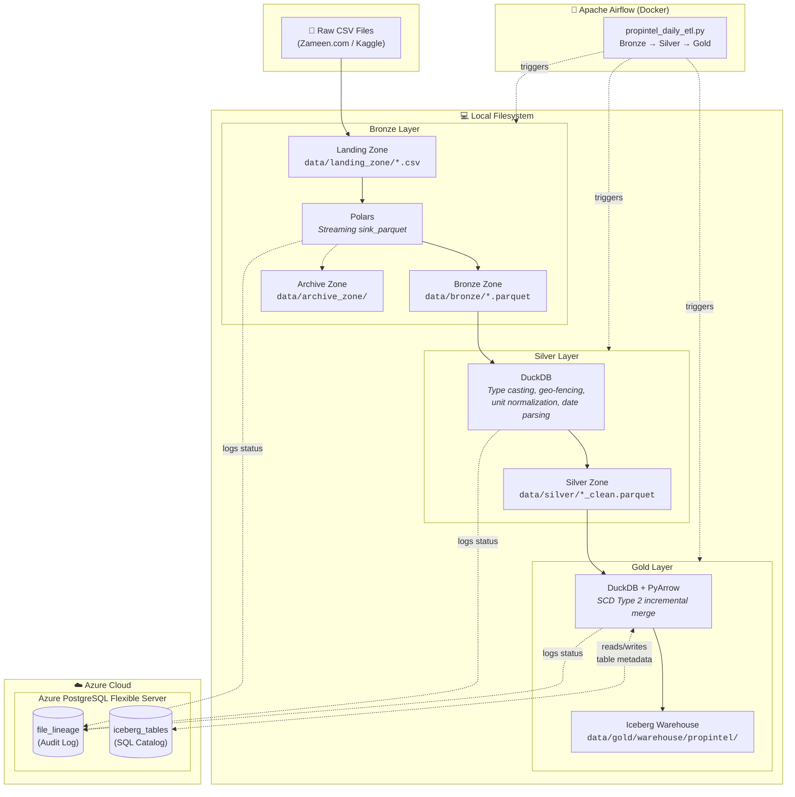

# PropIntel — Property Intelligence Platform


A production-grade data engineering pipeline that processes **simulated Pakistani real estate market data** through a full **Medallion Architecture** (Landing → Bronze → Silver → Gold). Synthesized daily property listings (generated from a base Zameen.com Kaggle dataset) are ingested, cleansed, standardized, and loaded into an **Apache Iceberg** lakehouse with **SCD Type 2** historical tracking — enabling analysts to query the exact price of any property at any point in time.

| | |
|---|---|
| **Data Source** | [Zameen.com Pakistan Real Estate (Kaggle)](https://www.kaggle.com/) — synthesized daily CSV snapshots, ~150K rows each |
| **Scale** | 122+ files × ~50 MB = ~6 GB raw (architecture designed for TB scale) |
| **Orchestration** | Apache Airflow (Dockerized, `@daily` schedule) |
| **Compute** | Polars (streaming ingestion), DuckDB (SQL transforms + SCD2 merge) |
| **Storage** | Apache Parquet (Bronze/Silver), Apache Iceberg (Gold) |
| **State Management** | Azure PostgreSQL — file lineage audit log + Iceberg SQL Catalog |

---

## Architecture

> The diagram below is written in [Mermaid.js](https://mermaid.js.org/). GitHub renders it automatically as a visual flowchart.



---

## What Happens at Each Layer

### Bronze — Raw Ingestion
**Script:** `src/ingestion/bronze_ingest.py` · **Engine:** Polars

- Scans the landing zone for new CSV files
- Computes a SHA-256 hash of each file (this hash becomes the **lineage key** that tracks the file across every layer)
- Streams the CSV into a compressed Parquet file using Polars' `sink_parquet` (avoids loading the entire file into RAM)
- Moves the original CSV to the archive zone after successful conversion
- Logs the result (success/failure, row count, file size) to Azure PostgreSQL via the `LineageTracker`

### Silver — Cleansing & Standardization
**Script:** `src/transformation/silver_transform.py` · **Engine:** DuckDB

- Queries the database to find which Bronze files have been processed but not yet cleaned
- For each eligible file, runs a single DuckDB `COPY` statement that applies all transformations in one pass:
  - **Type casting** — `TRY_CAST` safely converts strings to integers, doubles, dates (bad data becomes `NULL` instead of crashing)
  - **Date parsing** — Uses `try_strptime` with multiple format patterns (`%B %d, %Y`, `%m-%d-%Y`, `%m/%d/%Y`) to handle inconsistent source formats
  - **Unit normalization** — Converts Kanal to Marla (1 Kanal = 20 Marla), the standard Pakistani land unit
  - **Geo-fencing** — Validates latitude/longitude fall within Pakistan's geographic bounds (24°N–37°N, 61°E–78°E)
  - **Price capping** — Caps outlier prices at 500M PKR
  - **Derived metrics** — Calculates `price_per_marla` for standardized price comparison
  - **Default filling** — Replaces blank agency/agent fields with `'Direct Listing'` / `'Not Specified'`
- Writes the cleaned output to `data/silver/` as a new Parquet file
- Logs the result to Azure PostgreSQL

### Gold — Historical Tracking (SCD Type 2)
**Script:** `src/loading/gold_publish.py` · **Engine:** DuckDB + PyIceberg

- Queries the database to find which Silver files have not yet been processed into Gold
- Sorts files chronologically and processes them **one at a time** (this is critical — processing files out of order would corrupt the price history)
- For each file, separates data into **Sales** (`propintel.gold_sales`) and **Rentals** (`propintel.gold_rentals`)
- Loads the existing Iceberg table into DuckDB memory and runs an SCD Type 2 merge:
  - If a property's price **has not changed** → the existing record is kept as-is
  - If a property's price **has changed** → the old record is expired (`is_current = FALSE`, `valid_to = today`) and a new record is inserted (`is_current = TRUE`, `valid_from = today`)
  - If a property is **brand new** → a new record is inserted
- Overwrites the Iceberg table atomically using PyArrow (ACID-compliant snapshot)
- Tables are partitioned by `city` for query performance
- Logs the result to Azure PostgreSQL

---

## State Management

All pipeline state lives in a single **Azure PostgreSQL** instance, which serves two distinct purposes:

| Table | Managed By | Purpose |
|-------|-----------|---------|
| `file_lineage` | Our Python code (`LineageTracker`) | Tracks every file across every layer — hash, status, row count, error messages, retry count, Airflow run ID |
| `iceberg_tables` / `iceberg_namespace_properties` | PyIceberg (automatic) | Stores Iceberg table metadata — schema definitions, partition specs, pointers to physical data files |

The `LineageTracker` uses a **RAM-buffered bulk-flush** pattern: it pre-loads all known hashes into a Python `set()` at startup, processes files locally, and writes results to the database in a single `executemany` batch at the end — reducing network round-trips to Azure by orders of magnitude.

---

## Project Structure

```
PropI/
├── dags/
│   └── propintel_daily_etl.py           # Airflow DAG — orchestrates Bronze → Silver → Gold
│
├── src/
│   ├── ingestion/
│   │   └── bronze_ingest.py             # Landing → Bronze (Polars streaming)
│   ├── transformation/
│   │   └── silver_transform.py          # Bronze → Silver (DuckDB SQL)
│   ├── loading/
│   │   └── gold_publish.py              # Silver → Gold (DuckDB + Iceberg SCD2)
│   ├── helper_files/
│   │   ├── database.py                  # psycopg2 connection pool + context manager
│   │   ├── lineage.py                   # RAM-buffered bulk-flush LineageTracker
│   │   └── iceberg_catalog.py           # PyIceberg SQL Catalog + schema definitions
│   └── utils/
│       ├── dev_hard_reset.py            # Interactive CLI to rollback specific layers
│       ├── testing_gold_iceberg.py      # Gold layer validation script
│       ├── init_db.py                   # Database initialization utility
│       └── test_db.py                   # Database connection test
│
├── data/                                # Local data lake (gitignored)
│   ├── landing_zone/                    # Raw CSVs dropped here
│   ├── bronze/                          # Parquet files (1:1 from CSV)
│   ├── silver/                          # Cleaned Parquet files
│   ├── gold/warehouse/                  # Iceberg table data
│   └── archive_zone/                    # Processed CSVs (post-Bronze)
│
├── schema.sql                           # PostgreSQL schema (v2) — run on Azure
├── docker-compose.yml                   # Airflow infrastructure (4 services)
├── Dockerfile                           # Custom Airflow image with pipeline deps
├── requirements.txt                     # Python dependencies
├── .env.example                         # Environment variable template
├── problems_solved.md                   # Personal engineering decisions log
└── cloud_deployment.md                  # Azure cloud migration plan
```

---

## Infrastructure

Airflow runs locally via Docker Compose with 4 services:

| Service | Role |
|---------|------|
| `airflow-postgres` | Airflow's own internal metadata database (separate from Azure PostgreSQL) |
| `airflow-init` | One-time bootstrap — runs `airflow db migrate` and creates the admin user |
| `airflow-webserver` | The Airflow UI at `http://localhost:8080` |
| `airflow-scheduler` | Background process that reads DAGs and triggers tasks on schedule |

The `Dockerfile` builds a custom image on top of `apache/airflow:2.10.4`, installing `libpq-dev` (for PostgreSQL drivers) and all Python packages from `requirements.txt`. Your source code and data directories are mounted as Docker volumes — changes you make on your machine are instantly visible inside the container.

---

## Getting Started

**Prerequisites:** Python 3.11+, Docker & Docker Compose, an Azure PostgreSQL instance (or any PostgreSQL server)

```bash
# 1. Clone the repository
git clone https://github.com/ali786-hub/Property-Intelligence-Platform.git
cd Property-Intelligence-Platform

# 2. Configure credentials
cp .env.example .env
# Fill in your Azure PostgreSQL host, user, password, and local data paths

# 3. Initialize the database
# Copy schema.sql contents into your Azure PostgreSQL SQL editor and execute

# 4. Place raw CSV files
# Drop your Kaggle CSV files into the data/landing_zone/ directory

# 5a. Run via Airflow (recommended)
docker-compose up --build -d
# Open http://localhost:8080 — trigger the propintel_daily_etl DAG

# 5b. Run manually (for debugging)
python -m pip install -r requirements.txt
python src/ingestion/bronze_ingest.py
python src/transformation/silver_transform.py
python src/loading/gold_publish.py

# 6. Validate the Gold layer
python src/utils/testing_gold_iceberg.py

# 7. Need to undo a layer? Use the interactive rollback tool
python src/utils/dev_hard_reset.py
```

---

## Tech Stack

| Tool | Version | Role |
|------|---------|------|
| **Python** | 3.11 | Pipeline scripting |
| **Polars** | Latest | High-speed streaming CSV → Parquet (Bronze) |
| **DuckDB** | Latest | In-memory vectorized SQL engine (Silver + Gold) |
| **Apache Iceberg** | via PyIceberg | Open table format with ACID transactions and time-travel (Gold) |
| **PyArrow** | Latest | Columnar memory format for Iceberg read/write |
| **Apache Airflow** | 2.10.4 | DAG-based workflow orchestration and scheduling |
| **PostgreSQL** | Azure Flexible Server | File lineage tracking + Iceberg SQL Catalog |
| **Docker** | Compose v2 | Containerized Airflow deployment |
| **psycopg2** | Latest | PostgreSQL driver with connection pooling |

---

## Status

- [x] Landing → Bronze ETL (Polars streaming ingestion)
- [x] Bronze → Silver ETL (DuckDB transformations)
- [x] Silver → Gold ETL (Iceberg SCD Type 2 merge)
- [x] RAM-buffered LineageTracker with bulk-flush
- [x] Airflow DAG orchestration (Dockerized)
- [x] Database schema v2 (optimized for bulk upsert)
- [x] Interactive layer rollback tool (`dev_hard_reset.py`)
- [ ] Gold layer validation and testing
- [ ] Cloud migration — Azure Blob Storage + Azure VM compute
